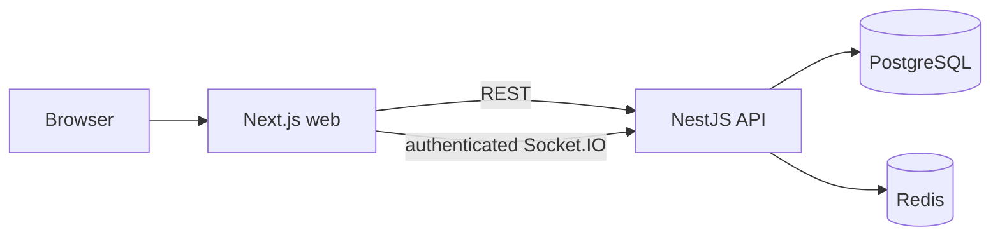

# SyncSpace

SyncSpace is a workspace and task collaboration platform under development. Phases 1–10 cover the foundation, authentication, workspaces, projects, tasks, live board updates, presence, conflict handling, comments, and activity history. Phase 11 includes a notification inbox, read state, and due-date reminders. Phase 12 adds private task attachments; invitation email delivery and production operations remain on the roadmap.

## Architecture



PostgreSQL holds durable product state. Redis holds ephemeral workspace presence; cross-instance socket delivery remains planned. `tech.nmd` is the authoritative engineering specification and roadmap; `process.md` records what is actually implemented.

## Local development

Prerequisites: Node 20+, pnpm 10+, Docker Compose. Copy `.env.example` to `.env` and adjust values. The sample credentials are local development values only.

```bash
pnpm install
docker compose up -d
pnpm db:migrate
pnpm dev
```

The Docker services use host ports 55432 (PostgreSQL) and 56379 (Redis) to avoid common local port conflicts.

For sign-up and login, set `NEXT_PUBLIC_SUPABASE_URL`, `NEXT_PUBLIC_SUPABASE_PUBLISHABLE_KEY`, and `SUPABASE_URL` in `.env` to the same Supabase project. Enable email/password and Google in Supabase Auth, use an asymmetric JWT signing key, and allow `http://localhost:3000/auth/callback` as a redirect URL. The API verifies the provider's JWKS independently. Without this configuration, the account controls show an availability state. The login flow cannot be tested against a real provider until these values exist.

For task files, set the server-only `SUPABASE_SERVICE_ROLE_KEY` and create the `STORAGE_BUCKET` in the same Supabase project. Keep the bucket private, set its file-size limit to **10 MB or less**, and restrict its allowed MIME types to a subset of `application/pdf`, `image/jpeg`, `image/png`, `image/webp`, and `text/plain`. The API verifies these bucket settings before signing an upload or download. Editors can upload, viewers can download, and an uploader or workspace admin can delete a file. A file appears only after the API checks the stored object's size and MIME type. The browser uploads directly through a short-lived signed URL; the service-role key stays on the API. Live bucket behavior and browser CORS still require a configured Supabase project to verify.

Signed-in users can create workspaces, invite teammates with a one-time link, and manage roles. Workspace owners and admins can create projects, add boards, and manage ordered columns. Editors and above can create and edit tasks, assign workspace members, add labels, set priority/due date, copy/archive tasks, and move them by drag/drop or keyboard controls. Task and column changes detect stale versions. Invitations are shared manually for now; email delivery is not implemented. The workspace owner can transfer ownership and archive the workspace. Archived workspaces and projects cannot currently be restored in the UI.

Board pages join an authorized Socket.IO room and refresh after task or column events. Connections use the current Supabase access token, are closed when it expires or membership is removed, and rejoin after reconnection. A visible status tells users when live updates are unavailable. REST remains the source of truth; there is no durable event replay or multi-instance socket adapter yet.

The board shows online workspace members. Redis leases track each socket separately, so another tab keeps a member online when one tab closes. The client sends a heartbeat every 30 seconds; leases expire after 90 seconds and each heartbeat refreshes the displayed list. Presence is temporary and is not written to PostgreSQL.

Task pages support comments from editors and above; viewers can read. Authors can edit or delete their own comments, with version conflicts reported clearly. Type `@member@example.com` or use the mention picker to notify a current workspace member. Comments are rendered as text, and authorized task sockets receive comment and short-lived typing events. The inbox at `/app/notifications` shows mentions, comments on assigned or created tasks, new assignments, role changes, and due reminders, with unread counts and read controls. Only current members can see notifications from their workspaces. The API scans at startup and every 15 minutes for tasks due within 24 hours or overdue by less than 24 hours; PostgreSQL prevents duplicate reminders for the same task due time and recipient.

Task and workspace pages show a paginated activity feed with the actor, action, time, and relevant task details. Only current workspace members can read it. Activity writes currently run after the primary mutation, so a transient failure may leave an activity gap; the API logs that failure and still returns the result of the completed mutation.

Workspace pages link to task search. Search matches task titles and descriptions through a PostgreSQL full-text index, can filter by project, assignee, and priority, and returns only active tasks in the signed-in member's workspace. Results are paginated at 20 per page.

Invitation creation and token acceptance have per-account Redis limits. Requests over the limit return HTTP 429, and the invitation routes return 503 if Redis cannot enforce the limit. Web and API responses set basic browser security headers. The API's CORS origin must match `WEB_ORIGIN`.

Web: `http://localhost:3000`. API health: `http://localhost:3001/api/v1/health`. The database migration command requires Docker or a compatible PostgreSQL instance. Redis is checked during API startup.
If the web server uses another port, set `WEB_ORIGIN` to that exact browser origin so REST and Socket.IO connections are accepted.

## Checks

```bash
pnpm check
pnpm test:integration
pnpm build
```

`pnpm check` runs format, lint, typecheck, and unit tests. Integration tests need the local services. CI also verifies that each project commit updates `process.md`.

## Status

Current phase and limitations are maintained in `process.md`. The complete feature plan, security model, data model, event catalog, and decisions are in `tech.nmd`.
