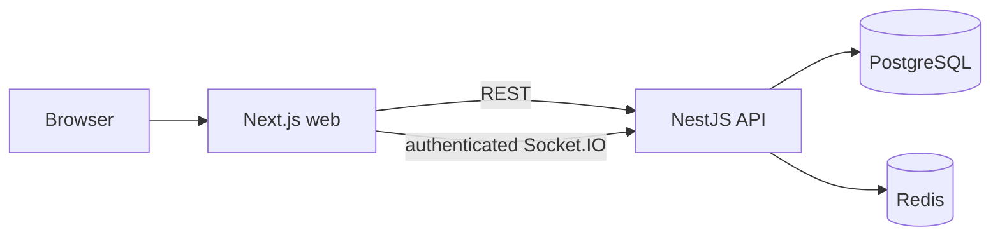

# SyncSpace

SyncSpace is a workspace and task collaboration platform under development. The repository contains governance, the Phase 1 foundation, Phase 2 authentication/profile flows, Phase 3 workspace membership and invitations, Phase 4 projects and boards, Phase 5 task management, Phase 6 authenticated board updates, and Phase 7 workspace presence. Comments, activity, notifications, and production operations remain on the roadmap.

## Architecture



PostgreSQL holds durable product state. Redis holds ephemeral workspace presence; cross-instance socket delivery remains planned. `tech.nmd` is the authoritative engineering specification and roadmap; `process.md` records what is actually implemented.

## Local development

Prerequisites: Node 20+, pnpm 10+, Docker Compose. Copy `.env.example` to `.env` and adjust values. The sample credentials are local development values only.

```bash
pnpm install
docker compose up -d
pnpm db:migrate
pnpm dev
```

The Docker services use host ports 55432 (PostgreSQL) and 56379 (Redis) to avoid common local port conflicts.

For sign-up and login, set `NEXT_PUBLIC_SUPABASE_URL`, `NEXT_PUBLIC_SUPABASE_PUBLISHABLE_KEY`, and `SUPABASE_URL` in `.env` to the same Supabase project. Enable email/password and Google in Supabase Auth, use an asymmetric JWT signing key, and allow `http://localhost:3000/auth/callback` as a redirect URL. The API verifies the provider's JWKS independently. Without this configuration, the account controls show an availability state. The login flow cannot be tested against a real provider until these values exist.

Signed-in users can create workspaces, invite teammates with a one-time link, and manage roles. Workspace owners and admins can create projects, add boards, and manage ordered columns. Editors and above can create and edit tasks, assign workspace members, add labels, set priority/due date, copy/archive tasks, and move them by drag/drop or keyboard controls. Task and column changes detect stale versions. Invitations are shared manually for now; email delivery is not implemented. The workspace owner can transfer ownership and archive the workspace. Archived workspaces and projects cannot currently be restored in the UI.

Board pages join an authorized Socket.IO room and refresh after task or column events. Connections use the current Supabase access token, are closed when it expires or membership is removed, and rejoin after reconnection. A visible status tells users when live updates are unavailable. REST remains the source of truth; there is no durable event replay or multi-instance socket adapter yet.

The board shows online workspace members. Redis leases track each socket separately, so another tab keeps a member online when one tab closes. The client sends a heartbeat every 30 seconds; leases expire after 90 seconds and each heartbeat refreshes the displayed list. Presence is temporary and is not written to PostgreSQL.

Web: `http://localhost:3000`. API health: `http://localhost:3001/api/v1/health`. The database migration command requires Docker or a compatible PostgreSQL instance. Redis is checked during API startup.
If the web server uses another port, set `WEB_ORIGIN` to that exact browser origin so REST and Socket.IO connections are accepted.

## Checks

```bash
pnpm check
pnpm test:integration
pnpm build
```

`pnpm check` runs format, lint, typecheck, and unit tests. Integration tests need the local services. CI also verifies that each project commit updates `process.md`.

## Status

Current phase and limitations are maintained in `process.md`. The complete feature plan, security model, data model, event catalog, and decisions are in `tech.nmd`.
